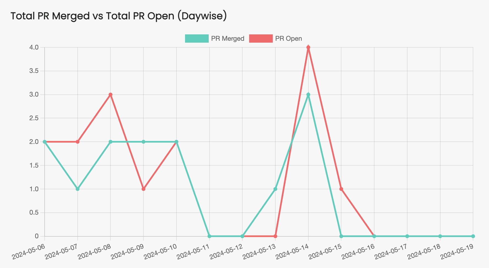
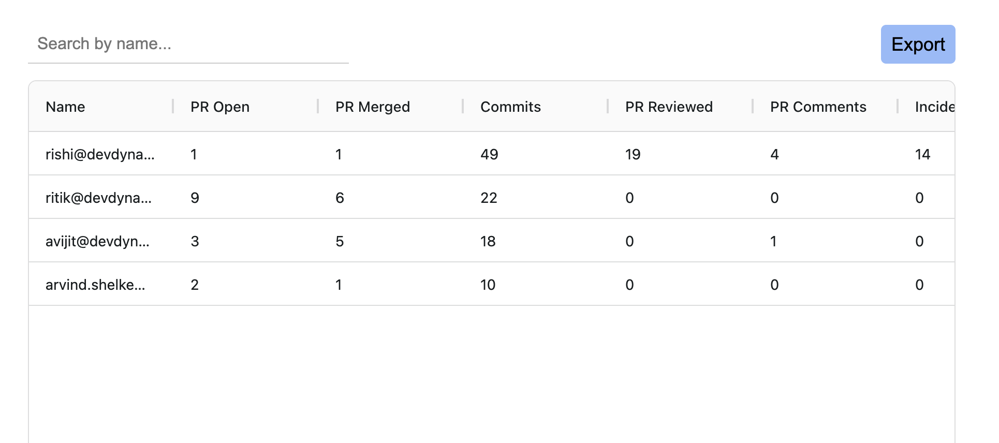

# Dynamatics

## Link : https://dynamatics.netlify.app/

### This is Developer's monitoring and understanding understading project.

- Understanding and PR raised and PR Merged by your team.
- Understanding commits done by your team by daywise.
- Monitor your incident and resolutions

### How to run it on local

- Clone the repo.
- `cd dynamatics`
- `npm install`
- `npm run dev`

### Build with

- React, React Router, Vite, ChartJS, Ag-Grid.

### Samples

